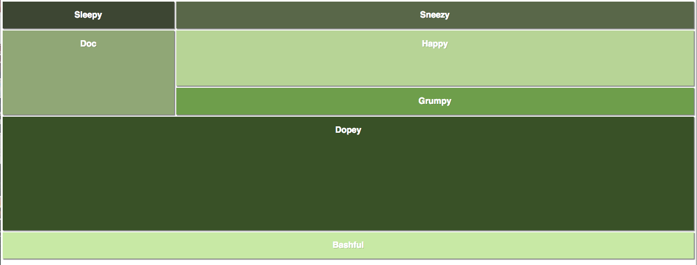

# Snow White and the Seven Divs

## Goal

## Launch Questions

* How many child divs will you need?
* How many columns are there? 
* How many divs _span_ BOTH columns?
* How many rows will we need? 
* How many divs _span_ multiple columns?
* Will you choose to use px, fr, vh + vw, %, or auto?

Consider drawing a mockup of the grid using a whiteboard and marker to help you plan out the parent div (container) and child divs that are necessary!

Pseudocode (using pen and paper) how you will build out this grid structure in a `.html` file. 

## STRETCH
* Instead of having text of each dwarf's name, use emojis, images, or gifs to represent each dwarf. 
* Using a javascript file and a CSS file, add event listeners to individual dwarfs to apply some styling that toggles on and off.

